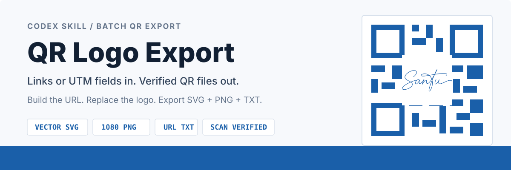
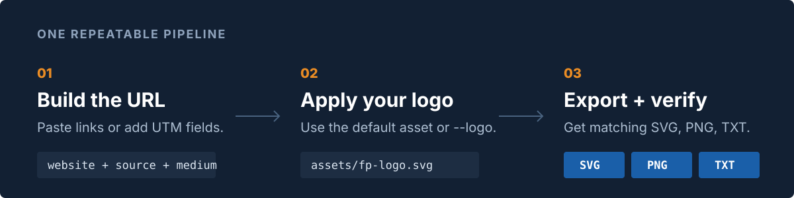

<p align="center">
  
</p>

<p align="center">
  <strong>中文</strong> | <a href="#english">English</a>
</p>

<p align="center">
  <a href="https://github.com/J-SanTu/qr-logo-export"><strong>Design by SanTu</strong></a>
</p>

# QR Logo Export

把完整链接，或“网址 + UTM 参数”，批量转换为品牌二维码。可以指定二维码本体颜色，也可以让它自动匹配 Logo 主色。每条链接同时导出真矢量 **SVG**、`1080 x 1080` **PNG** 和保存完整链接的 **TXT**，保留输入顺序，并生成逐张扫码验证结果。

> 默认使用蓝色 SanTu Logo；替换一个 SVG 文件，即可生成你公司的版本。

## 实际输出

<p align="center">
  
</p>

样张实际编码链接：[`https://xhslink.cn/m/1K6u87tKOIL`](https://xhslink.cn/m/1K6u87tKOIL)。该 PNG 已通过远程扫码验证，解码结果与短链接逐字一致。

| 输出 | 规格 |
| --- | --- |
| SVG | 纯矢量路径，不嵌入位图，任意缩放 |
| PNG | 默认 `1080 x 1080` 像素 |
| TXT | 与 SVG/PNG 同名，保存二维码实际编码的完整链接 |
| Logo | 居中、等比例缩放、保留原填充色 |
| 二维码 | 指定颜色或自动提取 Logo 主色；样张为 `#1A5FA9`、H 级容错、4 模块静区 |
| 验证 | 默认逐张远程解码，结果必须与原链接完全一致 |

<p align="center">
  
</p>

## 最快安装

需要 Codex 桌面端、Codex CLI 或 Codex IDE 扩展，以及 Python 3。

### 方式 A：从 GitHub 安装（推荐）

在 Codex 中输入：

```text
$skill-installer

请安装这个 Skill：
https://github.com/J-SanTu/qr-logo-export
```

安装完成后，再输入：

```text
请为刚安装的 $qr-logo-export 创建本地 .venv，安装 requirements.txt，并验证生成脚本可运行。
```

Skill 会在自己的目录内保存 Python 环境；`.venv` 已被排除，不会上传到 GitHub。

### 方式 B：手动安装

把仓库直接克隆到 Codex Skill 目录，然后安装运行依赖：

```bash
git clone https://github.com/J-SanTu/qr-logo-export.git \
  "${CODEX_HOME:-$HOME/.codex}/skills/qr-logo-export"
cd "${CODEX_HOME:-$HOME/.codex}/skills/qr-logo-export"
python3 -m venv .venv
.venv/bin/python -m pip install -r requirements.txt
```

安装后应能看到：

```text
~/.codex/skills/qr-logo-export/SKILL.md
```

如果设置了 `CODEX_HOME`，实际位置是 `$CODEX_HOME/skills/qr-logo-export`。Skill 没有立即出现时，重启 Codex。

## 30 秒生成第一批

安装后，在 Codex 中输入：

```text
使用 $qr-logo-export，把下面的链接依次生成带公司 Logo 的 SVG、PNG 和链接 TXT：
https://example.com/a
https://example.com/b
```

Codex 会保持链接顺序，生成同名 `.svg` / `.png` / `.txt` 文件，并输出 `manifest.csv` 和 `manifest.json`。

## 网址 + UTM 参数

只提供基础网址、`utm_source` 和 `utm_medium` 时，Skill 会先拼接完整链接，再把该链接写入二维码和同名 TXT。

输入示例：

```text
网址：www.abc.com
source：abc
medium：123
```

拼接结果：

```text
https://www.abc.com/?utm_source=abc&utm_medium=123
```

在 Codex 中可直接输入：

```text
使用 $qr-logo-export：
网址 www.abc.com
sourse: abc
medium: 123
```

命令行用法：

```bash
.venv/bin/python scripts/generate_qr_logo.py \
  --website 'www.abc.com' \
  --utm-source 'abc' \
  --utm-medium '123' \
  --output /absolute/path/output
```

`utm_source` 也兼容 `utm_sourse`、`source`、`sourse`；`utm_medium` 也兼容 `medium`。缺少协议时自动补 `https://`。原网址已有其他查询参数时会予以保留；已有同名 UTM 参数时会由新值替换。参数值会自动进行标准 URL 编码。

## 二维码颜色

颜色只作用于二维码模块本体，不会改变 Logo 自身颜色。

- 输入颜色时：支持 `#RGB` 或 `#RRGGBB`，例如 `#000000` 会生成纯黑二维码。
- 不输入颜色时：自动按 Logo 各条矢量路径的实际覆盖面积提取主要色调。
- 最终颜色会统一用于 SVG 和 PNG，并写入 `manifest.json` 的 `qr_color`；来源写入 `qr_color_source`，值为 `explicit` 或 `logo-dominant`。

在 Codex 中可直接输入：

```text
使用 $qr-logo-export 生成二维码：
网址：https://example.com
二维码颜色：#000000
```

命令行用法：

```bash
.venv/bin/python scripts/generate_qr_logo.py \
  --qr-color '#000000' \
  --output /absolute/path/output \
  'https://example.com'
```

省略 `--qr-color` 即启用 Logo 主色自动提取。命令行中的 `#` 可能被 Shell 识别为注释，因此颜色值应放在引号内。

## 替换公司 Logo

### 方式 A：永久替换默认 Logo

1. 准备公司 Logo 的 SVG 文件。
2. 将文字与描边转为轮廓，并展开群组和变换。
3. 保留数字形式的 `viewBox`，只使用带填充色的 `<path>`。
4. 用新文件覆盖 [`assets/santu-logo.svg`](./assets/santu-logo.svg)，文件名保持不变。
5. 先生成一张测试二维码，确认外观和扫码结果。

### 方式 B：单次使用其他 Logo

```bash
.venv/bin/python scripts/generate_qr_logo.py \
  --logo /absolute/path/company-logo.svg \
  --input /absolute/path/links.txt \
  --output /absolute/path/output
```

### Logo SVG 要求

| 支持 | 不支持 |
| --- | --- |
| 透明背景的真矢量 SVG | 嵌入 PNG / JPG |
| 数字 `viewBox` | `<text>` 文字元素 |
| 绝对坐标 `M/L/H/V/C/Z` 路径 | 群组、transform、stroke |
| 直接写在 `<path>` 上的填充色 | 裁切、遮罩、滤镜、CSS 或外部资源 |

> 若 Logo 不符合要求，请先在 Illustrator、Figma 或 Inkscape 中展开轮廓与变换后再导出。

## 批量输入

### TXT

每行一个 `http://` 或 `https://` 链接。空行与以 `#` 开头的行会被忽略。

```text
https://example.com/a
https://example.com/b
```

```bash
.venv/bin/python scripts/generate_qr_logo.py \
  --input /absolute/path/links.txt \
  --output /absolute/path/output
```

### CSV

CSV 可直接提供完整 `url`，也可以提供 `website` + UTM 字段；可选 `name` 用于控制文件名：

```csv
url,name
https://example.com/a,campaign-a
https://example.com/b,campaign-b
```

UTM 批量示例：

```csv
website,utm_source,utm_medium,name
www.abc.com,abc,123,abc-campaign
https://example.com/path,newsletter,email,email-campaign
```

## 脚本与环境

| 文件 | 用途 | 普通使用是否需要 |
| --- | --- | --- |
| `scripts/generate_qr_logo.py` | 拼接 UTM、生成 SVG/PNG/TXT、写入清单并执行扫码验证 | 是 |
| `requirements.txt` | 安装 Pillow 与证书依赖，供生成脚本运行 | 是，首次安装一次 |
| `requirements-dev.txt` | 在运行依赖之外安装 PyYAML | 仅维护或验证 Skill 时 |
| `quick_validate.py` | Codex 自带的 Skill 结构检查器，检查 `SKILL.md` 元数据与目录规范；它不生成二维码 | 普通使用不需要 |

维护者可安装开发依赖并运行 Codex 自带验证器：

```bash
.venv/bin/python -m pip install -r requirements-dev.txt
.venv/bin/python \
  "${CODEX_HOME:-$HOME/.codex}/skills/.system/skill-creator/scripts/quick_validate.py" .
```

`quick_validate.py` 不属于本仓库，上传 GitHub 时不需要复制它。

<details>
<summary><strong>维护者：更新现有 GitHub 仓库</strong></summary>

推荐先克隆一个干净副本，再把本地 Skill 内容同步进去。这样可删除远端已经废弃的旧素材，而不会把历史输出、测试批次或本地 `.venv` 一起上传。

```bash
git clone https://github.com/J-SanTu/qr-logo-export.git qr-logo-export-publish
rsync -a --delete --exclude='.git/' /absolute/path/to/qr-logo-export/ qr-logo-export-publish/
cd qr-logo-export-publish
git status
git add -A
git commit -m "Update QR Logo Export"
git push origin main
```

执行 `git add -A` 前先检查 `git status`。仓库的 `.gitignore` 已排除 `.venv/`、`outputs/`、缓存和系统文件。不要从二维码工具的上级工作目录直接执行 `git add .`。

</details>

## 完成标准

一批二维码只有在下列条件全部满足时才算完成：

- 每个唯一链接都有同名 SVG、PNG 和 TXT。
- TXT 内容与二维码实际编码的完整链接完全一致。
- `manifest.json` 记录最终二维码颜色及其 `explicit` 或 `logo-dominant` 来源。
- `manifest.json` 中 `failed` 为 `0`。
- 默认验证模式下，每一项的 `verified` 都为 `true`。
- 导出 SVG 不包含位图，中心留白不会产生半像素框线。

<details>
<summary><strong>高级参数</strong></summary>

```text
--size 2048          修改 PNG 尺寸，SVG 始终保持矢量
--qr-color '#000000' 指定二维码模块颜色；省略时自动提取 Logo 主色
--timeout 45         设置 HTTP 超时秒数
--retries 5          设置单次请求重试次数
--skip-verify        跳过远程解码，仅在明确接受未验证输出时使用
```

</details>

---

<a id="english"></a>

# English

QR Logo Export converts complete URLs, or a website plus UTM values, into branded QR codes. You can set the QR module color or let it automatically match the logo's dominant color. Each link produces a true-vector **SVG**, a `1080 x 1080` **PNG**, and a matching **TXT** containing the complete encoded URL. It preserves input order and records per-file scan verification.

> The bundled blue SanTu logo works out of the box. Replace one SVG asset to create your company's version.

## Output

The real QR example above encodes [`https://xhslink.cn/m/1K6u87tKOIL`](https://xhslink.cn/m/1K6u87tKOIL) and passed exact remote scan verification.

| Output | Specification |
| --- | --- |
| SVG | True vector paths, no embedded bitmap, resolution independent |
| PNG | `1080 x 1080` pixels by default |
| TXT | Same basename as SVG/PNG; contains the exact URL encoded in the QR code |
| Logo | Centered, aspect ratio preserved, original fill colors retained |
| QR code | Explicit color or automatically extracted logo color; the example uses `#1A5FA9`, error correction H, and a four-module quiet zone |
| Verification | Every PNG is decoded remotely and must match its source URL exactly |

## Quick install

You need Codex desktop, Codex CLI, or the Codex IDE extension, plus Python 3.

### Option A: install from GitHub (recommended)

```text
$skill-installer

Install this Skill:
https://github.com/J-SanTu/qr-logo-export
```

Then prompt Codex with:

```text
Create a local .venv for the installed $qr-logo-export Skill, install requirements.txt, and verify that the generator runs.
```

The Python environment remains inside the installed Skill; `.venv` is excluded from GitHub.

### Option B: manual installation

Clone the repository directly into the Codex Skill directory and install its runtime dependencies:

```bash
git clone https://github.com/J-SanTu/qr-logo-export.git \
  "${CODEX_HOME:-$HOME/.codex}/skills/qr-logo-export"
cd "${CODEX_HOME:-$HOME/.codex}/skills/qr-logo-export"
python3 -m venv .venv
.venv/bin/python -m pip install -r requirements.txt
```

Confirm that `~/.codex/skills/qr-logo-export/SKILL.md` exists. If `CODEX_HOME` is set, the actual path is `$CODEX_HOME/skills/qr-logo-export`. Restart Codex if the Skill does not appear immediately.

## First batch in 30 seconds

Prompt Codex with:

```text
Use $qr-logo-export to convert these links in order into SVG, PNG, and URL TXT files with the company logo:
https://example.com/a
https://example.com/b
```

Codex preserves link order, creates matching `.svg` / `.png` / `.txt` files, and writes `manifest.csv` plus `manifest.json`.

## Website + UTM values

When given a website, `utm_source`, and `utm_medium`, the Skill builds the complete URL before encoding it into the QR code and writing the matching TXT file.

Input:

```text
website: www.abc.com
source: abc
medium: 123
```

Result:

```text
https://www.abc.com/?utm_source=abc&utm_medium=123
```

CLI example:

```bash
.venv/bin/python scripts/generate_qr_logo.py \
  --website 'www.abc.com' \
  --utm-source 'abc' \
  --utm-medium '123' \
  --output /absolute/path/output
```

For `utm_source`, the aliases `utm_sourse`, `source`, and `sourse` are accepted. For `utm_medium`, `medium` is accepted. Missing schemes default to `https://`; unrelated existing query parameters are preserved; existing UTM values are replaced; parameter values are URL-encoded.

## QR color

The selected color changes QR modules only; it does not recolor the logo.

- With a color: pass `#RGB` or `#RRGGBB`. For example, `#000000` creates a pure-black QR code.
- Without a color: the generator measures the rendered area of the logo's vector paths and selects its dominant visible color.
- SVG and PNG use the same resolved color. `manifest.json` records it as `qr_color` and records `explicit` or `logo-dominant` as `qr_color_source`.

Prompt example:

```text
Use $qr-logo-export to generate a QR code:
URL: https://example.com
QR color: #000000
```

CLI example:

```bash
.venv/bin/python scripts/generate_qr_logo.py \
  --qr-color '#000000' \
  --output /absolute/path/output \
  'https://example.com'
```

Omit `--qr-color` to extract the dominant logo color automatically. Quote values containing `#` so the shell does not treat them as comments.

## Replace the company logo

### Option A: replace the default permanently

1. Prepare the company logo as an SVG.
2. Convert text and strokes to outlines, then expand groups and transforms.
3. Keep a numeric `viewBox` and filled `<path>` elements only.
4. Replace [`assets/santu-logo.svg`](./assets/santu-logo.svg) without changing the filename.
5. Generate one test QR code and verify its appearance and scan result.

### Option B: select a logo for one run

```bash
.venv/bin/python scripts/generate_qr_logo.py \
  --logo /absolute/path/company-logo.svg \
  --input /absolute/path/links.txt \
  --output /absolute/path/output
```

### Logo SVG requirements

| Supported | Not supported |
| --- | --- |
| Transparent-background, true-vector SVG | Embedded PNG / JPG |
| Numeric `viewBox` | `<text>` elements |
| Absolute `M/L/H/V/C/Z` path commands | Groups, transforms, or strokes |
| Fill colors directly on each `<path>` | Clipping, masks, filters, CSS, or external resources |

> If the logo does not meet these requirements, expand outlines and transforms in Illustrator, Figma, or Inkscape before exporting it again.

## Batch input

### TXT

Use one `http://` or `https://` URL per line. Blank lines and lines beginning with `#` are ignored.

```text
https://example.com/a
https://example.com/b
```

```bash
.venv/bin/python scripts/generate_qr_logo.py \
  --input /absolute/path/links.txt \
  --output /absolute/path/output
```

### CSV

CSV may contain a complete `url`, or a `website` plus UTM fields. The optional `name` column controls the output basename:

```csv
url,name
https://example.com/a,campaign-a
https://example.com/b,campaign-b
```

Structured UTM input:

```csv
website,utm_source,utm_medium,name
www.abc.com,abc,123,abc-campaign
https://example.com/path,newsletter,email,email-campaign
```

## Scripts and environment

| File | Purpose | Needed for normal use |
| --- | --- | --- |
| `scripts/generate_qr_logo.py` | Builds UTM URLs, exports SVG/PNG/TXT, writes manifests, and verifies scans | Yes |
| `requirements.txt` | Installs Pillow and certificate support for the generator | Yes, once during setup |
| `requirements-dev.txt` | Adds PyYAML to the runtime dependencies | Only for Skill maintenance or validation |
| `quick_validate.py` | Codex's built-in Skill structure checker; validates `SKILL.md` metadata and folder conventions but does not generate QR codes | No |

Maintainers can install the development dependencies and run Codex's bundled validator:

```bash
.venv/bin/python -m pip install -r requirements-dev.txt
.venv/bin/python \
  "${CODEX_HOME:-$HOME/.codex}/skills/.system/skill-creator/scripts/quick_validate.py" .
```

`quick_validate.py` is not part of this repository and should not be copied into GitHub.

<details>
<summary><strong>Maintainers: update the existing GitHub repository</strong></summary>

Start from a clean clone, then synchronize only the Skill contents. This removes obsolete tracked assets without uploading historical outputs, test batches, or the local `.venv`.

```bash
git clone https://github.com/J-SanTu/qr-logo-export.git qr-logo-export-publish
rsync -a --delete --exclude='.git/' /absolute/path/to/qr-logo-export/ qr-logo-export-publish/
cd qr-logo-export-publish
git status
git add -A
git commit -m "Update QR Logo Export"
git push origin main
```

Review `git status` before `git add -A`. The repository `.gitignore` excludes `.venv/`, `outputs/`, caches, and system files. Do not run `git add .` from the parent QR-tool workspace.

</details>

## Completion criteria

A batch is complete only when:

- Every unique URL has a matching SVG, PNG, and TXT.
- TXT content exactly matches the complete URL encoded in the QR code.
- `manifest.json` records the resolved QR color and its `explicit` or `logo-dominant` source.
- `failed` is `0` in `manifest.json`.
- Every item has `verified: true` when default verification is enabled.
- Exported SVG files contain no bitmap, and the module-aligned center cutout has no half-pixel frame.

<details>
<summary><strong>Advanced options</strong></summary>

```text
--size 2048          Change PNG dimensions; SVG remains vector
--qr-color '#000000' Set the QR module color; omit it to extract the logo color
--timeout 45         Set the HTTP timeout in seconds
--retries 5          Set attempts per HTTP request
--skip-verify        Skip remote decoding only when unverified output is explicitly acceptable
```

</details>
